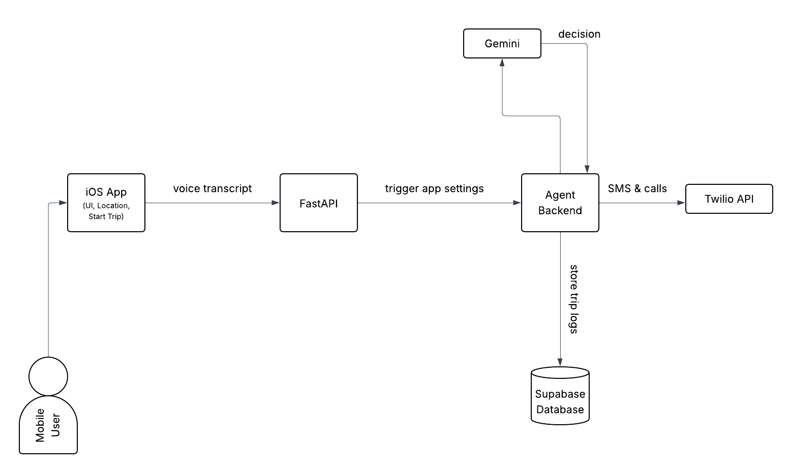

## 2. `ARCHITECTURE.md`

```markdown
# Architecture Overview

Below is the high level architecture diagram of Luna, our voice-activated safety agent.



## Components

1. **User Interface**
   - iOS App (Swift) with Mic input, Location tracking, Start/Stop Trip UI, and ability to begin Silent Mode (for dangerous situations where user does not want Luna to speak)

2. **Agent Core**  
   - **Planner**: Uses Gemini to determine intent and safety actions to be taken
   - **Executor**: Handles confirmed actions like speak, calling police, guiding to safe location 
   - **Memory**: Tracks current trip and past user behavior to inform safety action decisions
   - **Main Loop**: Orchestrates planning + execution  
   - **Sensors**: Monitors route deviation and other soft cues  

3. **Tools / APIs**  
   - Google Gemini API (LLM reasoning)  
   - Twilio API (optional: call/SMS)  
   - Supabase (Auth + Trip Data Storage) 

4. **Observability**  
   - Logs each decision step and reasoning 
   - Certain steps can not be taken more than once (ex. calling police) - keeps track of if critical one time actions ahve been taken
   - Ensures user concent is recieved before triggering critical functions 
   - Handles errors gracefully (LLM failure, API issues)

